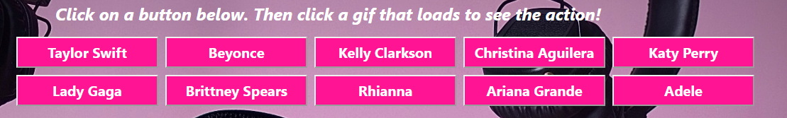
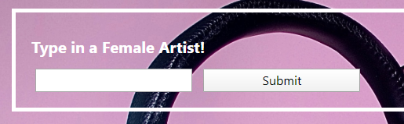
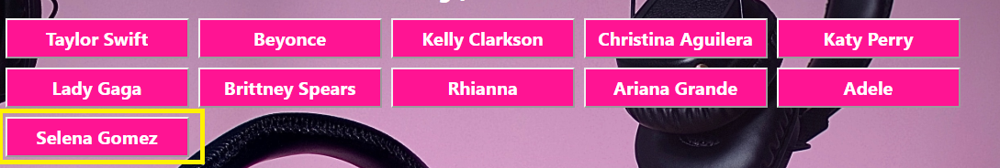

# GIPHY
Click on the pregenerated buttons and it'll load gifs associated with name of that button. In this project, it is themed on pop female artists. 

Click on each gif to watch the gif in action!

Static when initally displayed:  
When clicked: 

User can also add their choice of female artisit to the buttons. To do this, type in the female artist of choice. 

When pressing or clicking Submit or pressing the Enter key, watch the button then be generated and added to rest. Click on button user generated and it'll load gifs assoicated with the inputted artist. 

Click here to try it out: https://mhvue.github.io/GIPHY

This project uses jquery and AJAX method. It shows the significance of an API key as it uses GIPHY API to load the static and animated gifs. 
